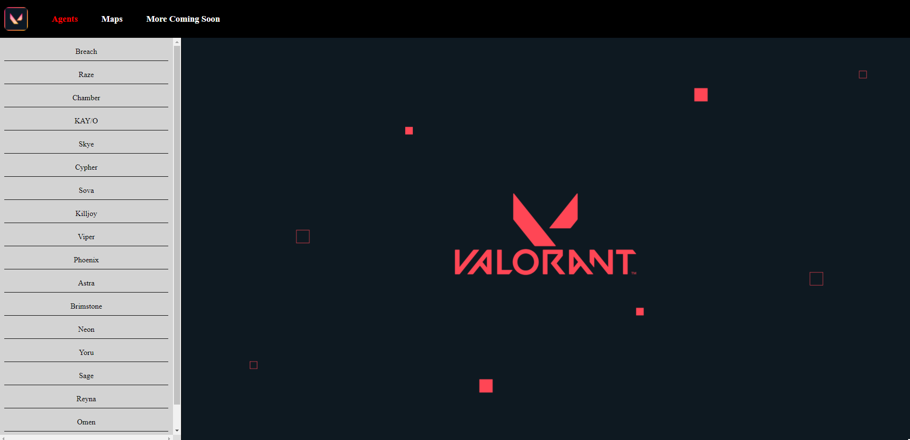

# WIKI-VALORANT

<strong>Andres Mora Barrantes<strong>
<p>
  <a href="https://www.linkedin.com/in/andres-mora-barrantes-144475192/" rel="nofollow noreferrer">
    
  </a> &nbsp; 
  <a href="https://github.com/amorabarrantes" rel="nofollow noreferrer">
    
  </a>
</p>

## Description
wiki-Valorant is a practice MVC Project, originally thinked to practice HTML, CSS and Javascript. Also, with this project I practiced API consumption, responsive-design, Javascript(events, classes, inheritance), and finally I used parcel to bundle the application.

The main purpose of the application, is to be a wiki of the Valorant game, in which the final user can consult from (agent, map or others) information.

## Screenshots
 
 <p align="center">
  Application General View
 <p>
<p align="center">
  </img>
</p>

 <p align="center">
  Entries View Example
 <p>
<p align="center">
  </img>
</p>

 <p align="center">
  Results View Example
 <p>
<p align="center">
  </img>
</p>

 <p align="center">
  Responsive Design example
 <p>
<p align="center">
  </img>
</p>

## How to run

1. Clone the project
2. Open the folder directory
3. Install dependencies with the following command:
```
npm install
```
Run the project with:
```
npm start
```

